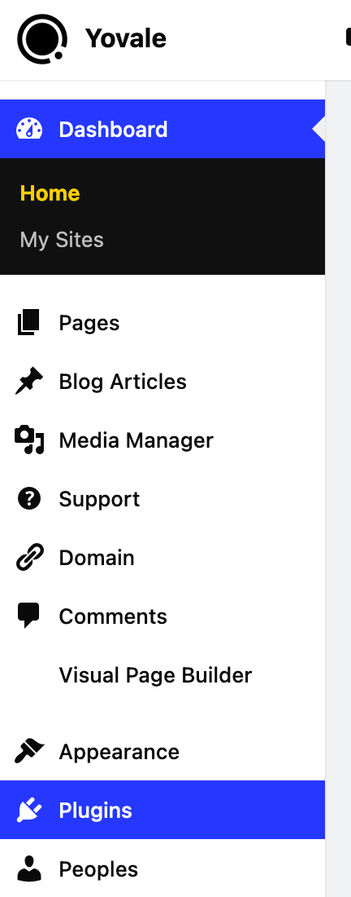
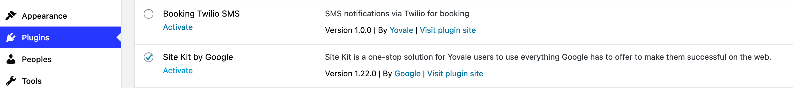
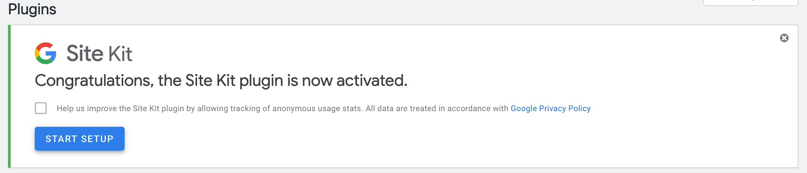
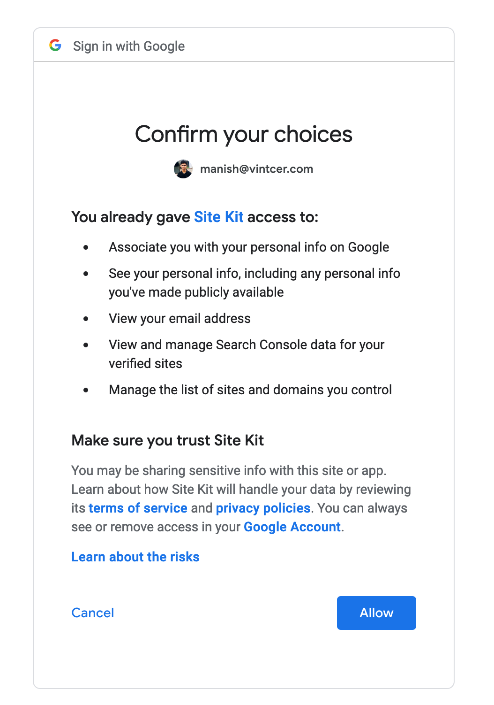
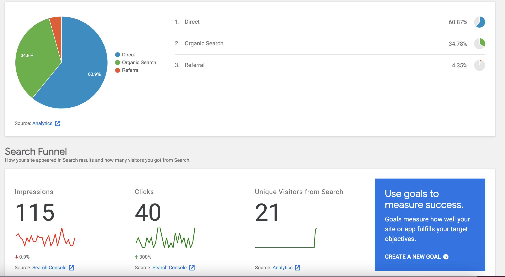

# Integrate Google Analytics and other Google services

## Activate Google Site Kit

1. From the left-side menu choose the Plugin option

###  Find and activate Google Site Kit

### After activating the Site kit, click on the START SETUP BUTTON

### Now Sign in with your Google Account and click on the Allow button 

Continue accepting the terms and click on the allow button. 

#### After completing the setup your analytics and search console data will be available both inside your Yovale dashboard and on Google analytics website

