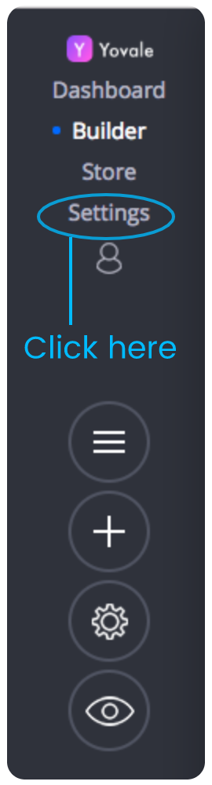
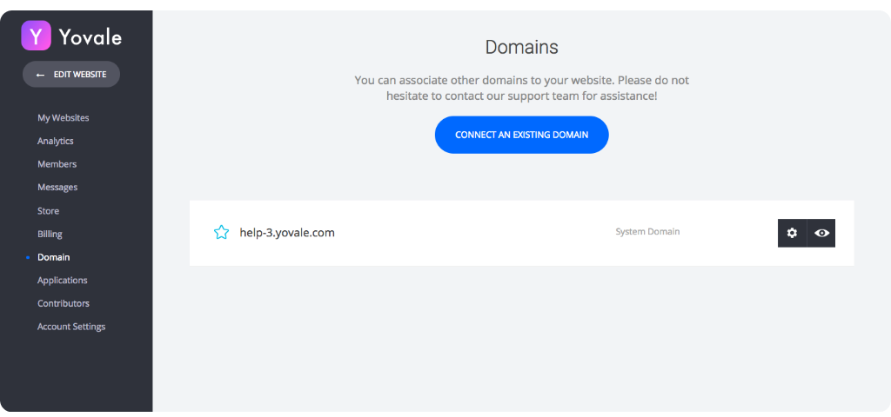
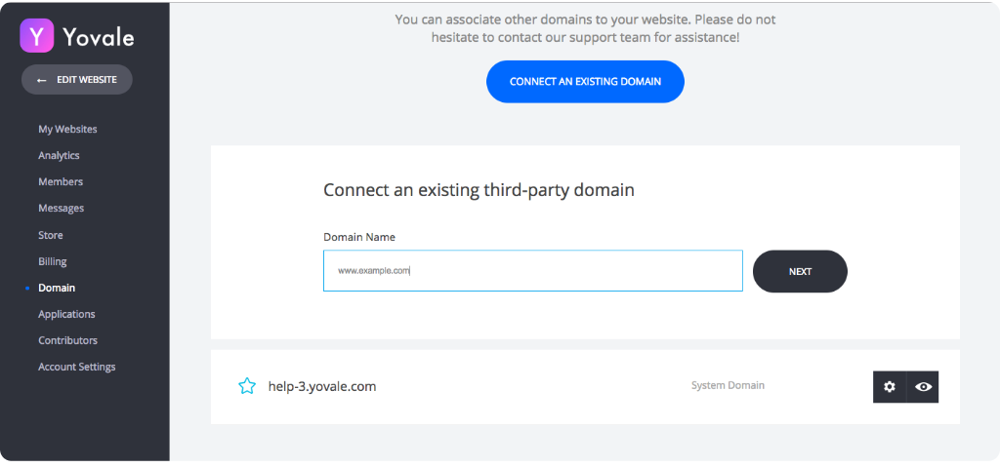
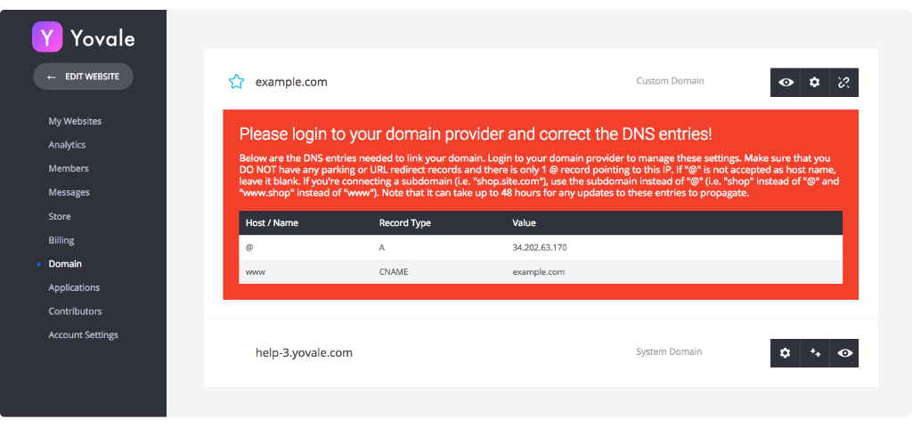

# Connect your own domain

Summary- 

In your registrar's Control Panel, change the A record and the CNAME:

A record -        Host --&gt; @           points to --&gt; 34.202.63.170

**CNAME -         Host --&gt; WWW                    points to --&gt; yourdomainname.com** 

1. Log in into your Yovale account.
2. Open Domain setting from setting tab \(located on left side of editor\)

3. After opening setting, choose domain from available options \(as shown in below picture\). And click on CONNET AN EXISTING DOMAIN button

4. Enter your Domain Name and Click Next.

5. After clicking on NEXT button you'll receive A record and CNAME records that you need to enter in your Domain management panel \(provided by your domain registrar\).

#### 6. Now, you domain is connected to your  Yovale website but you have to change your DNS setting in registrar account, please follow these steps to configure domain:-

**To connect your domain:**

a. Log in to your registrar account

The registrar is where you originally purchased the domain. If you don't remember who your registrar is, you can use [whois.net](http://whois.net/) to find out.

b. Locate the Control Panel or Domain Manager of your domain in your registrar account.

 The control panel allows you to change the DNS records from the default ones provided by the registrar.

 Different registrars may have different control panel layouts and other names for it as well. You         might find it under 'DNS Manager' or 'Domain Manager".

### 7. In your registrar's Control Panel, change the A record and the CNAME:

A record -        Host --&gt; @           points to --&gt; 34.202.63.170

**CNAME -         Host --&gt; WWW                    points to --&gt; yourdomainname.com**

Make sure to **SAVE** these changes. 

**Few important notes:**

a\) It may take up to 24 hours for these changes to propagate worldwide.

b\) If there are previous A records in your DNS settings - make sure to delete them.

### Check the next article on Resources to change A & CNAME records on different domain registrars. 

