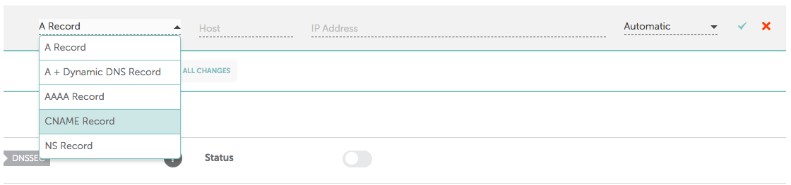
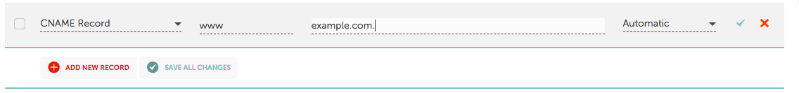
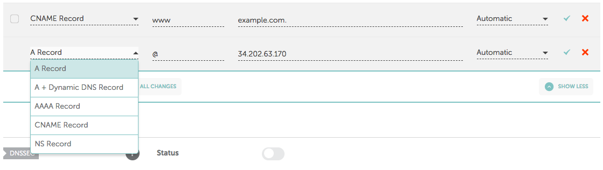

# Namecheap DNS records

  
1. Sign into your **Namecheap account** \(The Sign In option is available in the top hat of the page\).   
  
2. Select **Domain List** from the left sidebar and click on the **Manage** button next to your domain:

domain:  
  
  
  
  
3. Navigate to the **Advanced DNS** tab at the top of the page:   
  
  
  
  
4. Find the **Host records** section and click on the **Add New Record** button.

5. Choose CNAME Record from drop down options-

6. Enter the required settings and click on ✓ button to save the changes.

  **Host --&gt; WWW                    points to --&gt; yourdomainname.com**

7. Now, add the A record and click on ✓ button to save the changes.

**A record -        Host --&gt; @           points to --&gt; 34.202.63.170**

Thats all your website would be live within few hours. 

**Few important notes:**

1\) It may take up to 24 hours for these changes to propagate worldwide.

2\) If there are previous A records in your DNS settings - make sure to delete them.  

