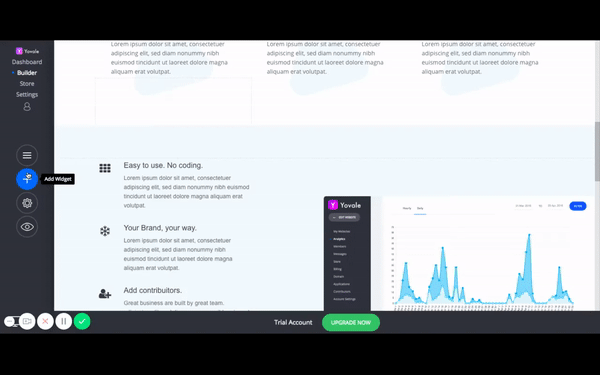
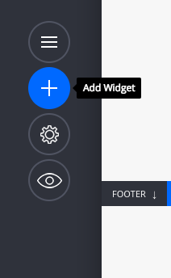
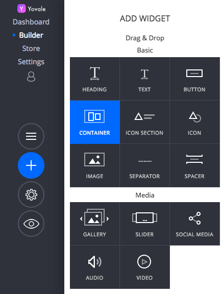
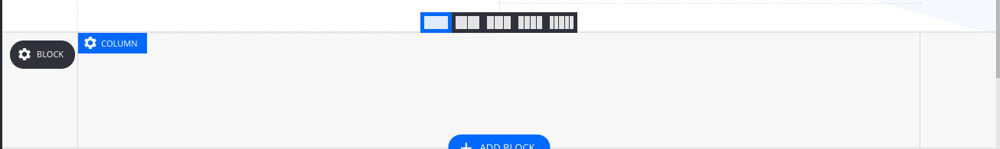
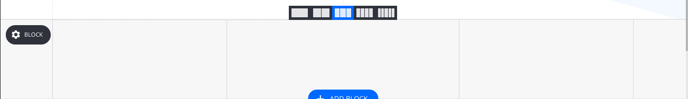
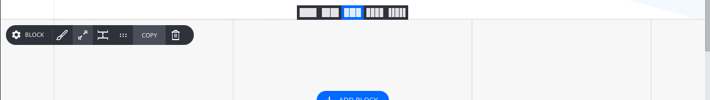

# Container \(important\)

The container is the main building block of each website. They help you organize your content and widgets into sections. 

### **Note:- Container and Add a block button are same.**

1. Click on the + button to add a Container

2. Choose the Container from available widget

3. Click and Drag the widget to your website to add container in your website.

4. You can split the column \(container\) in 2-5 Container . See the picture below

#### 5. After adding Container you can add any widget inside them.

6. You can remove Side margin from Block setting. Click on setting button \(on left side\) and Click on the resize \(two arrow\) button to open 

