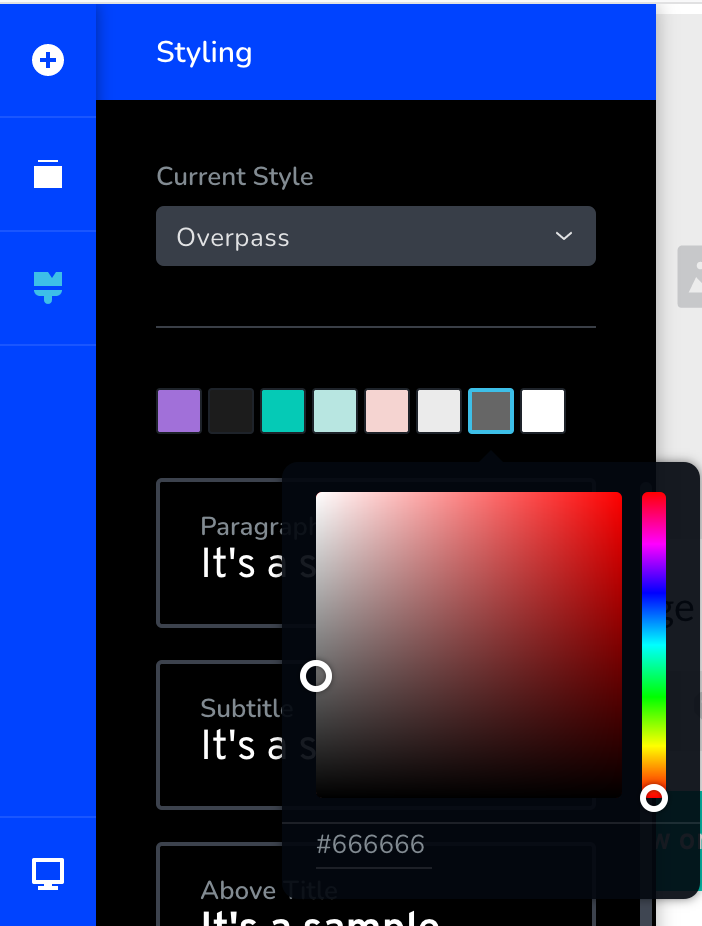

# Builder global color pallet

The Global Color Palette feature allows you to set your default colors which will then appear in the color picker inside the website builder.

## From the left bar, click on the Brush icon

Define up to 8 colors for your custom color palette 

