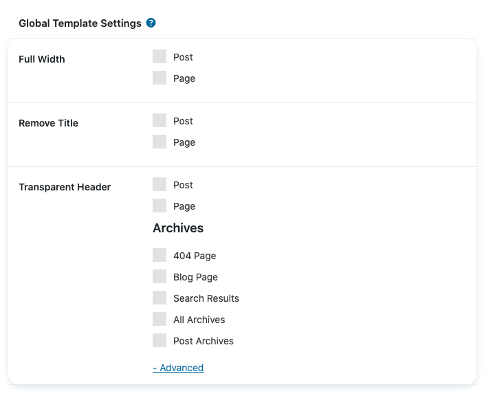

# Theme Global Template Settings


These setting are not required if you are using the drag and drop builder for creating everything like shop pages etc. 


The Global Template Settings are located under _Appearance -&gt; Theme Settings_ in your Yovale Dashboard

Set templates to full-width, activate transparent headers, and hide the page title globally for posts, and pages 

### Transparent Header Settings

Clicking the advanced button will allow you to activate transparent headers for any other pages

